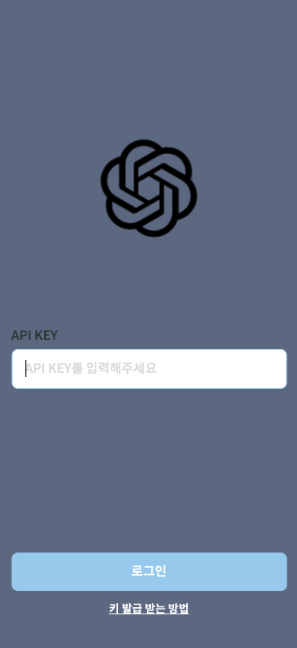
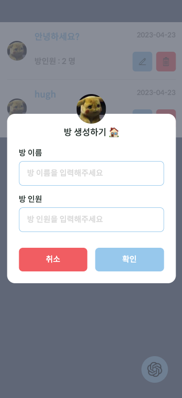
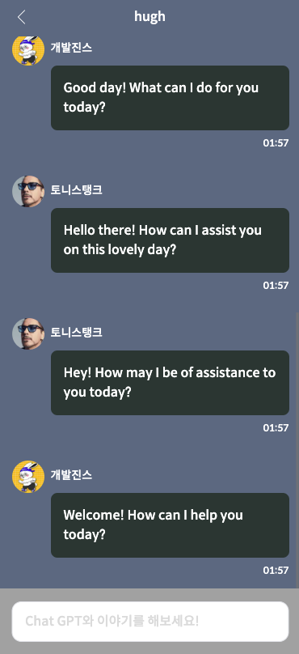

# Chat GPT 챗팅방 개발 🤖

Next.js 기반의 Chat GPT API를 활용한 Chat 구현 프로젝트!

<br>

## 프로젝트 실행 방법 🚀

```
npm i

npm run dev
```

<br>

## 사이트 주소 🪩

https://kyu-pt.vercel.app/ (open ai API-key 필요)

<br>

## 회고 🧑🏻‍💻

https://kokyusik91.github.io/tech/eleventh/

<br>

## 페이지 소개 🌁

<table>
  <tr>
    <td>로그인 페이지</td>
    <td>채팅방 목록 페이지</td>
    <td>채팅방 생성 모달</td>
    <td>채팅방 페이지</td>
  </tr>
  <tr>
    <td>
      
    </td>
    <td>
     
    </td>
     <td>
      
    </td>
    <td>
     
    </td>
  </tr>
  
</table>

<br>

## 기술 스택 🛠️

- typescript : 강력한 타입 시스템 지원
- storybook : 프로젝트와 독립된 상태로 컴포넌트 개발을 위해 사용. 컴포넌트 문서화를 도와줌.
- tailwindcss : 이미 정해진 classname을 활용한 빠른 개발.
- next.js : open ai와의 API key 기반 http 통신을 하기 위해 백엔드 서버 필요했음. 기타 최적화된 컴포넌트 사용가능.
- indexedDB : 채팅방 목록, 채팅 대화목록 데이터를 웹 브라우저에 저장. cookie, localstorage 보다 장점이 더 많기 때문(모든 자료형 저장가능, 비동기식)에 선택.
  <br>
  <br>

## 주요 기능 🧑🏼‍🏫

- api-key를 통한 인증
- 채팅방 목록 CRUD
- 웹 스토리지 중 하나인 indexedDB 연결
- chat GPT API 사용한 chat
- 채팅방 인원 수에 따른 gpt 다수 처럼 응답

  <br>

## 디렉토리 구조 📂

<details markdown="1">
<summary>자세히 보기</summary>

```
.
├── .storybook
│   ├── main.ts
│   └── preview.ts
├── node_modules
│   └── ...
├── public
│   ├── fonts
│   ├── icons
│   └── images
├── src
│   ├── components
│   │      ├── common
│   │      │    └── 공통 ui.tsx
│   │      ├── icon
│   │      │    └── Icon.tsx
│   │      │
│   │      └── layout
│   │           ├── Layout.tsx
│   │           └── ScaffoldPage.tsx
│   ├── constants
│   │    └── z-index.ts
│   ├── pages
│   │    ├── _app.tsx
│   │    ├── _document.tsx
│   │    ├── home.tsx
│   │    ├── indext.tsx
│   │    ├── chatroom
│   │    │     └── [slug].tsx
│   │    └── api
│   │         ├── chat.ts
│   │         └── login.ts
│   ├── styles
│   │    └── global.css
│   └── util
│        ├── DatabaseService.ts
│        ├── fetchInstance.ts
│        ├── index.ts
│        ├── indexedDB.ts
│        ├── service.ts
│        └── types.ts
|
├── postcss.config.js
├── package-lock.json
├── package.json
├── next.config.js
├── tailwind.config.js
├── tsconfig.json
├── .eslintrc.json
├── .prettierrc.json
└── README.md
```

</details>

<br>

### 컴포넌트 📁

<br>

- `/components/*` : page 하위 컴포넌트 폴더
  - `common/*` : 재사용 컴포넌트들
    - `기본UI.tsx` : 버튼, 인풋, 모달, 아이콘 버튼, 유저 아바타 등 최소단위 컴포넌트
    - `Chating.tsx` : 채팅 대화형식 UI
    - `Chat.tsx` : 채팅방 목록 UI
    - `AppHeader.tsx` : 페이지 상단 공통 Header UI
    - `CommonHeader.ts` : 모든 페이지 상단의 공통 Header
  - `Icon/*`
    - `Icon.tsx` : 프로젝트 Icon 공통화 컴포넌트 예) `<Icon icon='like'>`
  - `layout/*`
    - `Layout.ts` : 최상단 공통 레이아웃 (가운데로 배치하는 역할)
    - `ScaffoldPage.tsx` : 각 페이지 레이아웃

<br>

### 페이지 📚

<br>

- `/pages/*` : 실제 라우팅 되는 페이지들 + 백엔드 Routes
  - `_app.tsx` : next page 최상단
  - `_document.tsx` : html 삽입할 수 있는 파일
  - `index.tsx` : 메인 로그인 페이지
  - `home.tsx` : 채팅방 목록 노출 페이지
  - `chatroom/*` : 채팅방 하위 연결하는 중간.
    - `[slug].ts` : 채팅방 동적 라우팅 페이지
  - `api/*`
    - `chat.ts` : open ai와 chat 관련 HTTP 통신
    - `login.ts` : open ai와 인증 관련 HTTP 통신

<br>

### 기타 유틸 🔨

<br>

- `/util/*` : 컴포넌트, 페이지 이외 유틸 폴더
  - `index.ts` : 공통적으로 사용되는 함수들
  - `fetchInstance.ts` : web API fetch함수를 메서드에 따른 추상화
  - `indexedDB.ts` : indexedDB 구현체
  - `DatabaseService.ts` : indexedDB 추상화 파일
  - `service.ts` : 프로젝트에서 사용하는 api endpoint들
  - `types.ts` : 프로젝트에서 사용하는 공통 타입들

<br>

## 핵심 로직 코드 🔥

### indexedDB 관련 코드

1. indexedDB 구현체 [참고 코드](https://github.com/kokyusik91/kyuPT/blob/main/src/util/DatabaseService.ts)
2. indexedDB 한번 추상화 [참고 코드](https://github.com/kokyusik91/kyuPT/blob/main/src/util/indexedDB.ts)

<br>

### open ai API 관련 코드

1. API Routes [참고 코드](https://github.com/kokyusik91/kyuPT/blob/main/src/pages/api/chat.ts)

<br>

### 채팅방 로직 코드

1. gpt와 채팅 (1:1 혹은 1:다수) [참고 코드](https://github.com/kokyusik91/kyuPT/blob/main/src/pages/chatroom/%5Bslug%5D.tsx)
